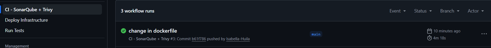
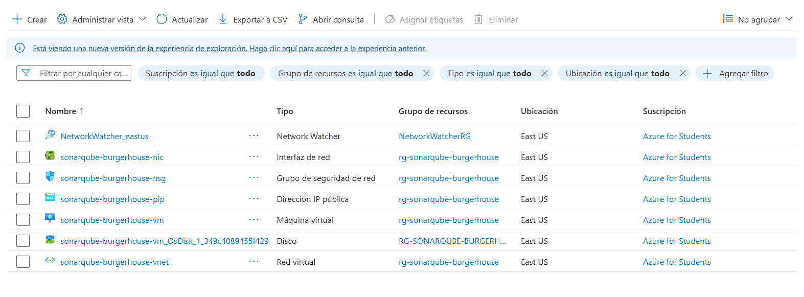

# SonarQube + Trivy en Azure VM con Terraform

## Nombre: Isabella Huila Cerón
## Código: A00394751

En este laboratorio implementé una **pipeline DevSecOps completa** que integra **SonarQube** para análisis de código, **Trivy** para escaneos de seguridad, y **Terraform** para la infraestructura.
Todo se ejecuta y automatiza desde **GitHub Actions**, con una máquina virtual en **Azure** que aloja el servidor de SonarQube.

---

## Paso 1: Configuración de Secrets en GitHub

Antes de crear los archivos del proyecto, configuré los **secrets** necesarios en GitHub.

### 1.1 Obtener credenciales de Azure

Abrí **Azure Cloud Shell** y ejecuté los siguientes comandos:

```bash
az login
az account show --query id -o tsv
az ad sp create-for-rbac \
  --name "github-sonarqube-sp" \
  --role contributor \
  --scopes /subscriptions/<MI_SUBSCRIPTION_ID> \
  --sdk-auth
```

Esto me devolvió un JSON con las credenciales del **Service Principal**, el cual guardé para usarlo en los secretos del repositorio.

### 1.2 Crear Secrets en GitHub

Luego, en GitHub → **Settings → Secrets and variables → Actions**, creé los siguientes secretos:

| Nombre              | Valor                                      |
| ------------------- | ------------------------------------------ |
| `AZURE_CREDENTIALS` | Todo el JSON generado anteriormente        |
| `VM_ADMIN_PASSWORD` | Una contraseña segura    |
| `SONAR_TOKEN`       | Token temporal (lo actualicé más adelante) |
| `SONAR_HOST_URL`    | Se configuró después de desplegar la VM    |

---

## Paso 2: Estructura del Proyecto

Creé la siguiente estructura de carpetas en la raíz del proyecto:

```
NEXT-BURGERHOUSE/
├── .github/
│   └── workflows/
│       ├── infra.yml
│       └── ci.yml
├── infra/
│   └── terraform/
│       ├── main.tf
│       ├── variables.tf
│       ├── outputs.tf
│       └── cloud-init.yml
├── sonar-project.properties
├── package.json
└── Dockerfile
```

---

## Paso 3: Infraestructura con Terraform

Configuré la infraestructura con **Terraform**, la cual crea:

* Un **Resource Group** en Azure
* Una **VNet** con su subred
* Un **NSG** con los puertos 22 y 9000 abiertos
* Una **IP pública**
* Una **máquina virtual Ubuntu** que ejecuta Docker y levanta los contenedores de **SonarQube** y **PostgreSQL** mediante un archivo `cloud-init.yml`

Los archivos principales que utilicé fueron:

* `main.tf`
* `variables.tf`
* `outputs.tf`
* `cloud-init.yml`

---

## Paso 4: Workflows de GitHub Actions

### 4.1 Workflow de Infraestructura (`.github/workflows/infra.yml`)

Este workflow ejecuta los comandos de Terraform para inicializar, planificar y aplicar la infraestructura en Azure.
Al finalizar, muestra la **IP pública** de la VM donde se levanta SonarQube.

### 4.2 Workflow CI/CD (`.github/workflows/ci.yml`)

El segundo workflow se encarga del análisis estático y la seguridad.
Incluye los siguientes pasos:

* Instalación de dependencias
* Ejecución de pruebas con Jest (generando cobertura)
* Escaneo de código, IaC y contenedor con Trivy
* Análisis de calidad con SonarQube
* Publicación de resultados en **SonarQube** y **GitHub Security**

---

## Paso 5: Configuraciones del Proyecto

### 5.1 Scripts de `package.json`

Agregué los siguientes scripts para manejar las pruebas y la cobertura:

```json
{
  "scripts": {
    "test": "jest",
    "test:watch": "jest --watch",
    "test:cov": "jest --coverage",
    "cov:local": "jest --coverage --testFailureExitCode=0"
  }
}
```

### 5.2 Archivo `sonar-project.properties`

Configuré el proyecto para que SonarQube pudiera leer la cobertura de Jest (`coverage/lcov.info`) y analizar el código de NestJS.

### 5.3 Dockerfile

Incluí el Dockerfile necesario para construir la imagen de la aplicación, que luego es escaneada con Trivy.

---

## Paso 6: Despliegue Paso a Paso

1. Creé todos los archivos del proyecto (Terraform, workflows, Dockerfile, sonar-project.properties, etc.).
2. Hice commit y push al repositorio:

   ```bash
   git add .
   git commit -m "Add Terraform infra + CI/CD workflows"
   git push origin main
   ```
3. Desde GitHub Actions, ejecuté el workflow **"Deploy Infrastructure"**.
4. Esperé a que terminara el despliegue y obtuve la **URL pública de SonarQube** generada por Terraform.

---


## RESULTADOS:







